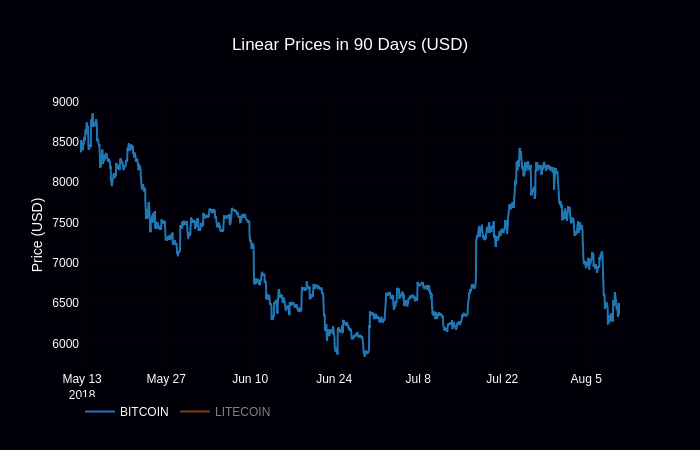
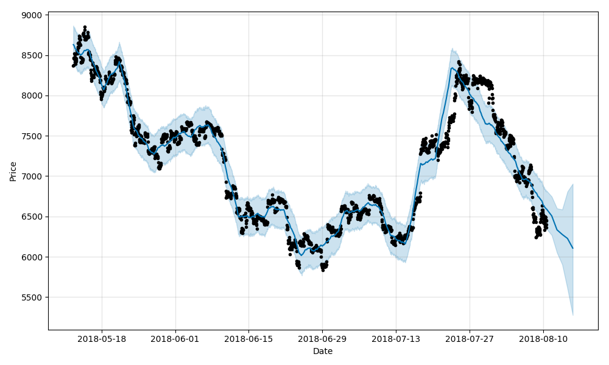
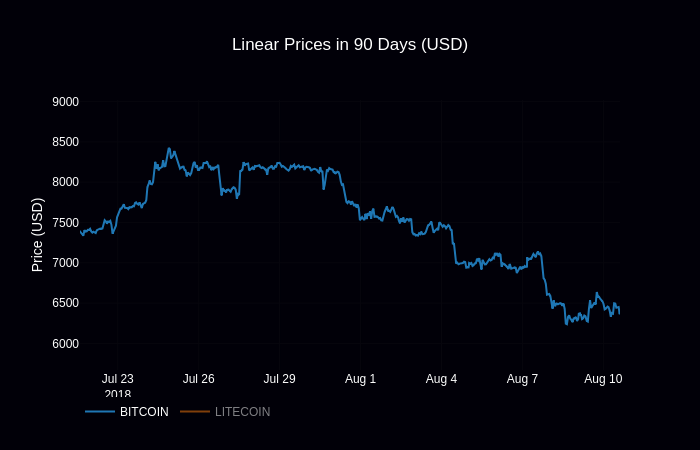
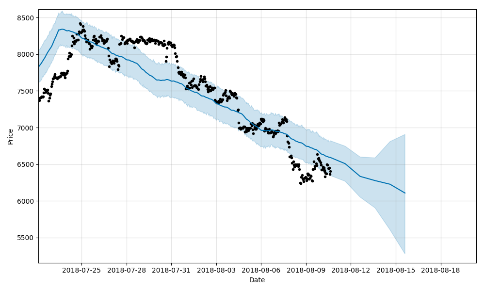

# Cryptocurrency prediction

Deep tecnical analysis with **ANY** cryptocurrency

## Setup

Go to `configs/vars` and edit these lines:
```python
coins = ['bitcoin','nano','binancecoin','steem']
days = 90
currency = 'usd'
```
---
## Run

```sh
git clone https://github.com/Draichi/cryptocurrency_prediction.git
cd cryptocurrency_prediction
mkdir models
mkdir datasets
pip3 install -r requirements.txt
python3 lin.py
# python3 log.py to see in logarithm scale
python3 forecast.py [asset]
# e.g.: python3 forecast bitcoin
```


Forecast:


Zoom:


Forecast:


## Credits
- [Analyzing](https://blog.patricktriest.com/analyzing-cryptocurrencies-python/) cryptocurrency markets using python