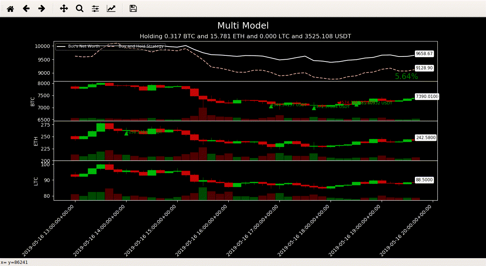
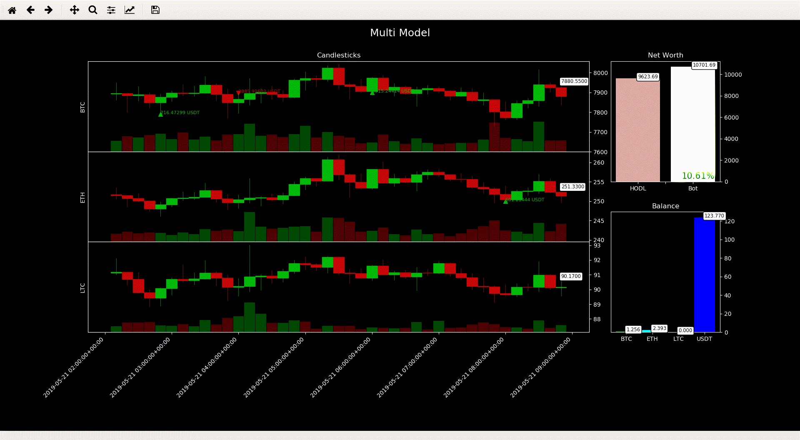
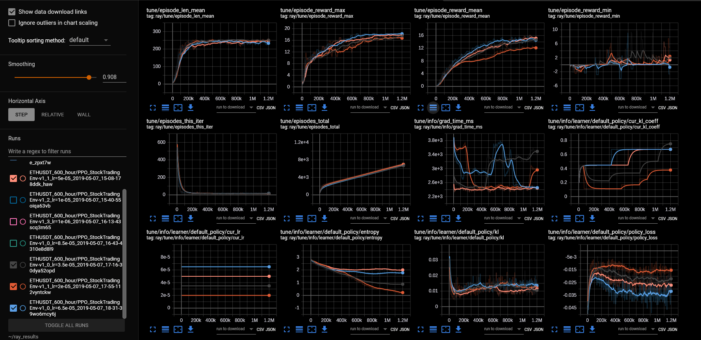
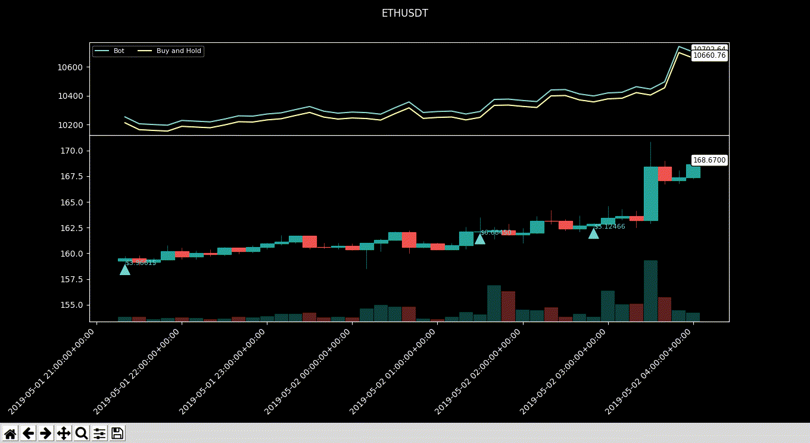

# Crypto Trading Environment


[](https://app.codacy.com/app/Draichi/cryptocurrency_prediction?utm_source=github.com&utm_medium=referral&utm_content=Draichi/cryptocurrency_prediction&utm_campaign=Badge_Grade_Dashboard)

Trainable deep reinforcement learning agents to operate in the cryptocurrency market


> 7 % profit in 1 month trading LTC/USDT

* * *

<!-- 

> 5 % profit trading BTC/USDT ETH/USDT and LTC/USDT at the same time (wip) -->



> 10 % profit trading BTC/USDT ETH/USDT and LTC/USDT at the same time (wip)

## Prerequisites

-   [Miniconda](https://conda.io/docs/user-guide/install/index.html) or Anaconda

## Setup

### Ubuntu

```sh
# make sure you have these installed
sudo apt-get install gcc g++ build-essential python-dev python3-dev htop
# create env
conda env create -f UBUNTU_CPU.yml
# activate it
conda activate crypto_prediction
```

### Mac

```sh
# create env
conda env create -f MAC_CPU.yml
# activate it
conda activate crypto_prediction
```

* * *

## Algotrading

You can use one of these
[algorithms](https://ray.readthedocs.io/en/latest/rllib-algorithms.html)

### Train

Go to `/configs/vars.py` and custumize it:

```python
SYMBOL_1, SYMBOL_2, SYMBOL_3 = 'LTC', 'ETH', 'OMG'
TRADE_INTRUMENT = 'USDT'
LIMIT = 1500
HISTO = 'minute'
...
```

```sh
# multi model
python train_multi_model.py

# single pair
python train.py \
        --algo PPO \
        --pair XRP/USDT \
```



### Monitoring

```sh
# to keep monitoring while the algo is trainning
tensorboard --logdir=./tensorflow
# or
gpustat -i
# or
htop
```

### Evaluate

It will automatically use a different time period to evaluate

```sh
# multi model
python rollout_multi_model.py ./tensorboard/path_to_checkpoint-100 \
        --run PPO \
        --env TradingEnv-v0

# single pair
python rollout.py /path_to_checkpoint/file \
        --run PPO \
        --env TradingEnv-v0 \
        --pair XRP/BTC \
        --histo day \
        --limit 180
```

<div style="text-align:center">
  
</div>

## Customizing

Edit the commision and initial balance values in `/configs/vars.py`

* * *

## Credits

-   [Papers](https://github.com/Draichi/Portfolio-Management-list/blob/master/README.md)
-   [Analyzing cryptocurrency markets using python](https://blog.patricktriest.com/analyzing-cryptocurrencies-python/)
-   [Q-trader](https://github.com/edwardhdlu/q-trader)
-   [Trading-Gym](https://github.com/thedimlebowski/Trading-Gym)
-   [Adam King](https://towardsdatascience.com/@notadamking)

* * *

<div style="text-align:center">
  
</div>