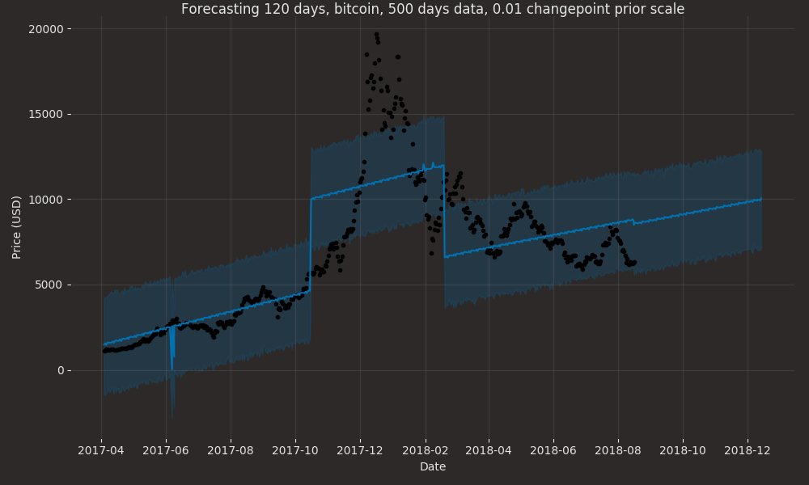
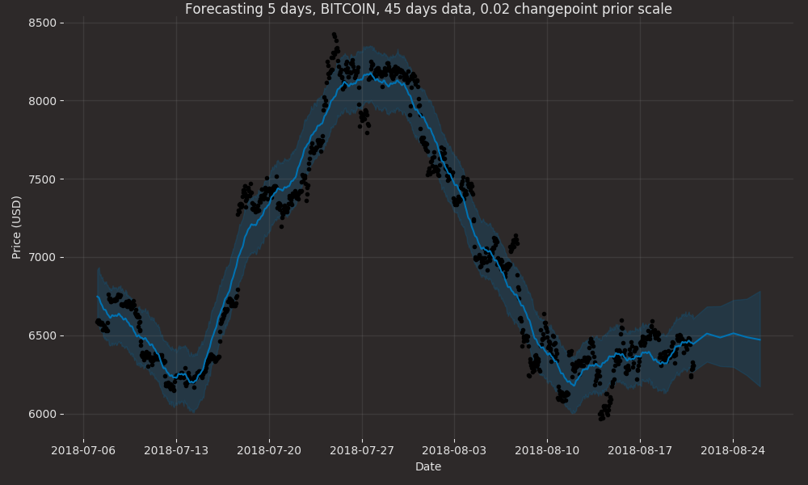

# Cryptocurrency prediction

Deep tecnical analysis with **ANY** cryptocurrency

## Setup

Go to `configs/vars` and edit these lines:
```python
coins = ['bitcoin','nano','binancecoin','steem']
days = 90
currency = 'usd'
```
---
## Run

```sh
git clone https://github.com/Draichi/cryptocurrency_prediction.git
cd cryptocurrency_prediction
mkdir models
mkdir datasets
pip3 install -r requirements.txt
```

```sh
python3 forecast.py [asset] [how_many_days]
# e.g.: python3 forecast.py bitcoin 5
```




```sh
python3 scatter.py log
# log/linear = layout type
```


## Genetic Algorithm

Now you have the data you can use reinforcement learning to make profit into those market movements

```sh
python3 train.py [asset] [window_size] [how_many_episodes]
# e.g.: python3 train.py bitcoin 10 1000
```


Use historical data to train a model and evaluate with fresh data

```sh
python3 evaluate.py [asset] [model]
# e.g.: python3 evaluate.py bitcoin 10-8_bitcoin_d90_e20_w12_c50_usd
```


Price in: blue = buy, yellow = sell, white = hold

## Credits
- Analyzing cryptocurrency markets using python: [article](https://blog.patricktriest.com/analyzing-cryptocurrencies-python/)
- Q-trader: [repo](https://github.com/edwardhdlu/q-trader)

## To-do
- [x] grab data from coingekko
- [x] use genetic algorithm
- [ ] implement model with exchanges or gekko
