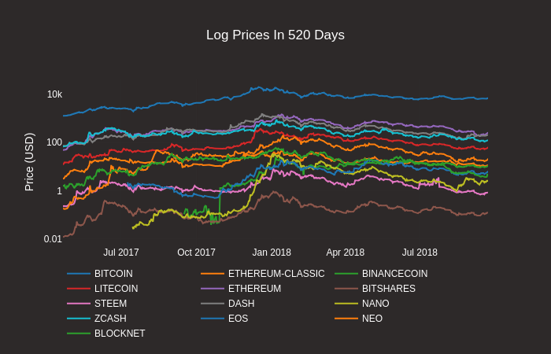
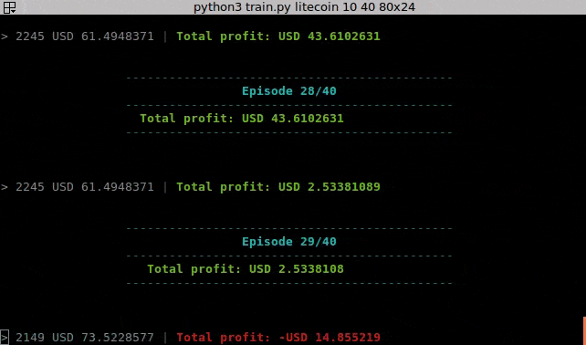
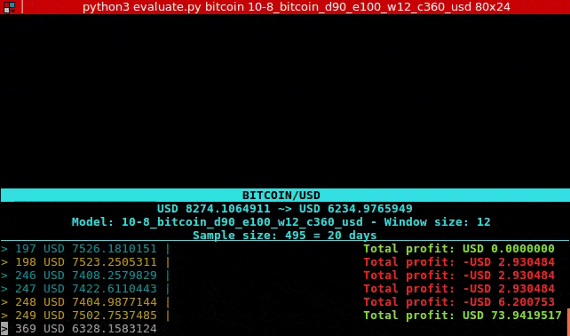

# Cryptocurrency prediction

Deep tecnical analysis with [**ANY**](https://www.coingecko.com/en) cryptocurrency

See also this live [demo](https://bud-fox.github.io/live/)

## Prerequisites

1. Ubuntu (tested on 16.04)
2. Python 3
3. [Miniconda](https://conda.io/docs/user-guide/install/index.html) or Anaconda

## Setup

Go to `configs/vars` and edit these lines:
```python
coins = ['bitcoin','nano','binancecoin','steem']
days = 90
currency = 'usd'
```
---

### Ubuntu
```sh
sudo apt-get install gcc g++ build-essential python-dev python3-dev
# make sure you have these installed
conda env create -f UBUNTU_CPU.yml
# create env
```
### Windows
```sh
# make sure you have a recent C++ compiler
conda env create -f WINDOWS_CPU.yml
# create env
```
### Mac
```sh
conda env create -f MAC_CPU.yml
# create env
```

---

```sh
python forecast.py [asset] [how_many_days]
# e.g.: python3 forecast.py bitcoin 5
# open the /path/to/crytocurrency_prediction/temp-plot.html file
```
<div>
    <a href="https://plot.ly/~randy_marsh/19/" target="_blank" title="24-8 bitcoin 0.01" style="display: block; text-align: center;"></a>
</div>


```sh
python scatter.py log
# log/linear = layout type
```



```sh
python correlation_heatmap.py
```
<div>
    <a href="https://plot.ly/~randy_marsh/47/?share_key=KiwLmIfF01AgF7CqocfQbR" target="_blank" title="correlation heatmap" style="display: block; text-align: center;"></a>
</div>

---

## DQN

```sh
python train.py [asset] [window_size] [how_many_episodes]
# e.g.: python3 train.py bitcoin 10 1000
```



Use historical data to train a model and evaluate with fresh data

```sh
python evaluate.py [asset] [model]
# e.g.: python3 evaluate.py bitcoin 10-8_bitcoin_d90_e20_w12_c50_usd
```



Price in: blue = buy, yellow = sell, white = hold

---

## Credits
- Analyzing cryptocurrency markets using python: [article](https://blog.patricktriest.com/analyzing-cryptocurrencies-python/)
- Q-trader: [repo](https://github.com/edwardhdlu/q-trader)

## To-do
- [x] grab data from coingekko
- [x] use genetic algorithm
- [ ] implement model with exchanges or gekko


