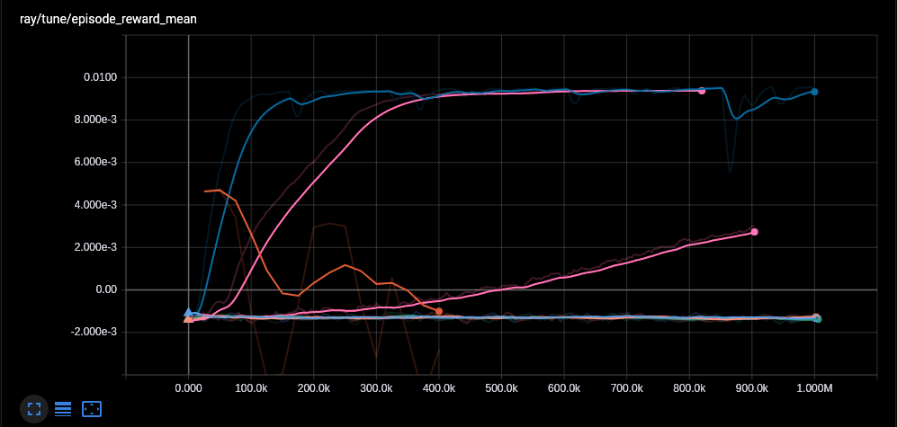
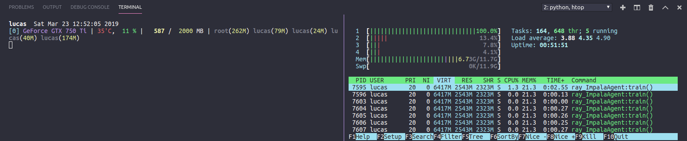

# Cryptocurrency prediction


[](https://app.codacy.com/app/Draichi/cryptocurrency_prediction?utm_source=github.com&utm_medium=referral&utm_content=Draichi/cryptocurrency_prediction&utm_campaign=Badge_Grade_Dashboard)

Deep tecnical analysis of cryptocurrencies with reinforcement learning

<!-- TODO -->
<!-- GIF WITH APP RUNNING -->
<!-- LINKs -->
-   [Rolling Correlation](https://draichi.github.io/cryptocurrency_prediction/rolling_corr_DASH_2019-04-16.html)
-   [Spearman Correlation](https://draichi.github.io/cryptocurrency_prediction/correlation_spearman_2019-04-16.html)
-   [Portfolio Returns](https://draichi.github.io/cryptocurrency_prediction/returns_2019-04-16.html)
-   [Propheting 51 day(s) of ETH (Changepoint: 0.57)](https://draichi.github.io/cryptocurrency_prediction/prophet_2019-04-16_ETH.html)
-   [Weights per asset at different expected returns (%)](https://draichi.github.io/cryptocurrency_prediction/weights_2019-04-16.html)
-   [Risk associated with different levels of returns](https://draichi.github.io/cryptocurrency_prediction/efficient_frontier_2019-04-16.html)

## Prerequisites

-   [Miniconda](https://conda.io/docs/user-guide/install/index.html) or Anaconda
-   [Node](https://nodejs.org/en/)

## Setup

>To use the portfolio funcions you must initiate the server :

### Ubuntu

```sh
sudo apt-get install gcc g++ build-essential python-dev python3-dev htop
# make sure you have these installed
conda env create -f UBUNTU_CPU.yml
# create env
conda activate crypto_prediction
# activate it
python server.py
# init server at localhost:3030
```

### Windows

```sh
# make sure you have a recent C++ compiler
conda env create -f WINDOWS_CPU.yml
# create env
conda activate crypto_prediction
# activate it
python server.py
# init server at localhost:3030
```

### Mac

```sh
conda env create -f MAC_CPU.yml
# create env
conda activate crypto_prediction
# activate it
python server.py
# init server at localhost:3030
```

>You can use the online [dashboard](https://draichi.github.io/cryptocurrency_prediction/index.html) or initiate yours:


```sh
cd app
# go to /cryptocurrency_prediction/app
yarn
# or `npm i`
yarn serve
# or `npm run dev`
```

* * *

## Algotrading

The data seen on dashboard will be used to train an agent to operate in the market. But first:

### Register Env

Add this to `~/miniconda3/envs/crypto_prediction/lib/python3.5/site-packages/gym/envs/__init__.py`:

```python
# Custon Env
# ----------------------------------------
register(
    id='Trading-v0',
    entry_point='gym.envs.trading_gym:TradingEnv',
    reward_threshold=2.0,

)
```
and paste the `trading_gym` folder inside `~/miniconda3/envs/crypto_prediction/lib/python3.5/site-packages/gym/envs/`

### Train

```sh
# there are 2 versions beens developed
# one can run using the env registered above
rllib train --run PPO --env Trading-v0 --stop '{"timesteps_total": 180000}' --checkpoint-freq 10 --config '{"lr": 1e-5, "num_workers": 2, "observation_filter": "MeanStdFilter"}'

# the latter use an env registed in the file itself
python run_agent.py --symbol ltc --algo PPO
```



> Different algorithms compared (mean reward in BTC)

```sh
# to keep monitoring while the algo is trainning you can
# run one of these lines in different terminal windows
tensorboard --logdir=~/ray_results
gpustat -i
htop
```



### Evaluate

You must pick a different time period to evaluate how it performs (wip)

```sh
# wip
rllib rollout /home/lucas/ray_results/default/PPO_Trading-v0_0_2019-03-26_09-40-05q0q7h143/checkpoint_20/checkpoint-20 --run PPO --env Trading-v0 --steps 1000
```

* * *

## Credits

-   [Papers](https://github.com/Draichi/Portfolio-Management-list/blob/master/README.md)
-   [Analyzing cryptocurrency markets using python](https://blog.patricktriest.com/analyzing-cryptocurrencies-python/)
-   [Q-trader](https://github.com/edwardhdlu/q-trader)

* * *

<div style="text-align:center">
  
</div>