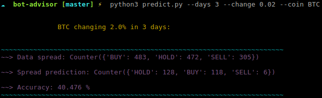
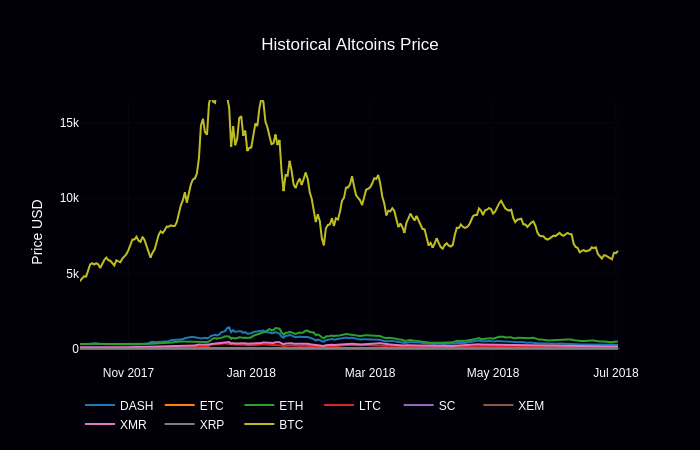
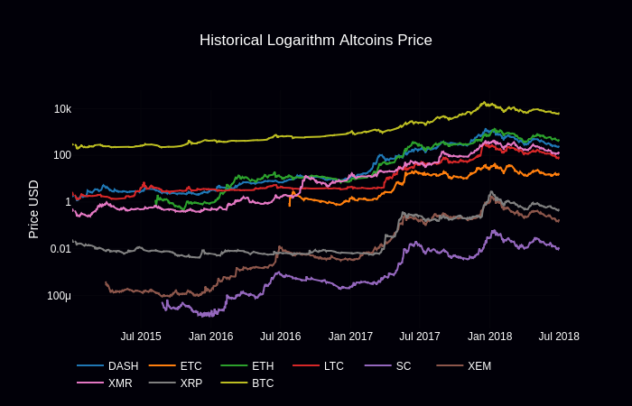
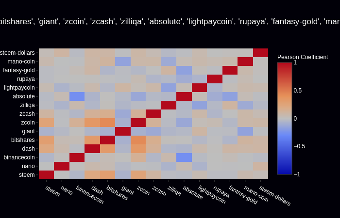

# Bot Advisor

Bot advisor using machine learning to give insights about market movements


## Setup

Go to `configs/vars` and add what coins you want and how many days of data
```python
coins = ['giant','steem', 'nano', 'binancecoin', 'neo', 'bitshares',]
days = 365
```
---
```sh
pip3 install -r requirements.txt

python3 predict.py --days 7 --change 0.02 --coin bitcoin
```

---
```sh
python3 lin.py
```

---
```sh
python3 log.py
# a window will pop-up with the chart
```

---
```sh
python3 heat.py --year 2017
```

---

as we have 3 options (hold, buy, sell) accuracy is calculated different, 33% accuracy means randomness, we difficult will get more than 70%
