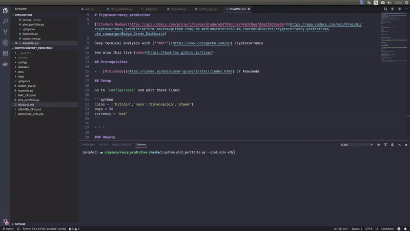

# Cryptocurrency prediction

[](https://app.codacy.com/app/Draichi/cryptocurrency_prediction?utm_source=github.com&utm_medium=referral&utm_content=Draichi/cryptocurrency_prediction&utm_campaign=Badge_Grade_Dashboard)

Deep tecnical analysis with [**ANY**](https://datalight.me/) cryptocurrency

See also this live [demo](https://bud-fox.github.io/live/)

## Prerequisites

-   [Miniconda](https://conda.io/docs/user-guide/install/index.html) or Anaconda
-   [Node](https://nodejs.org/en/)

## Setup

Go to `configs/vars` and edit these lines:

```python
PORTFOLIO_SYMBOLS = [
    'eth',
    'xrp',
    'ltc'
]
TIME_INTERVAL = '1d'
FROM_DATE = '2018-11-01'
TO_DATE = '2019-03-18'
```

* * *

### Ubuntu

```sh
sudo apt-get install gcc g++ build-essential python-dev python3-dev htop
# make sure you have these installed
conda env create -f UBUNTU_CPU.yml
# create env
```

### Windows

```sh
# make sure you have a recent C++ compiler
conda env create -f WINDOWS_CPU.yml
# create env
```

### Mac

```sh
conda env create -f MAC_CPU.yml
# create env
```

* * *

```sh
python plot_portfolio.py --plot_coin [COIN_NAME]
# e.g.: python plot_portfolio.py --plot_coin eth
# open the /path/to/crytocurrency_prediction/temp-plot.html file
```



## Live demos

-   [Dashboard LTC Momentum](https://draichi.github.io/cryptocurrency_prediction/dashboard_ltc_momentum.html)
-   [Dashboard LTC Hype](https://draichi.github.io/cryptocurrency_prediction/dashboard_ltc_hype.html)
-   [Dashboard LTC Prophet](https://draichi.github.io/cryptocurrency_prediction/dashboard_LTC_prophet.html)
-   [Portfolio Weigths](https://draichi.github.io/cryptocurrency_prediction/weights.html)
-   [Kendall Correlation](https://draichi.github.io/cryptocurrency_prediction/kendall_correlation.html)
-   [Efficient Frontier](https://draichi.github.io/cryptocurrency_prediction/efficient_frontier.html)


* * *

## Algotrading

<!-- ```sh
python run_agent.py --symbol ltc --algo IMPALA
``` -->

## registering Env

Add this to `~/miniconda3/envs/crypto_prediction/lib/python3.5/site-packages/gym/envs/__init__.py`:

```python
# Custon Env
# ----------------------------------------
register(
    id='Trading-v0',
    entry_point='gym.envs.trading_gym:TradingEnv',
    reward_threshold=2.0,

)
```
and paste the `trading_gym` folder inside `~/miniconda3/envs/crypto_prediction/lib/python3.5/site-packages/gym/envs/`

## Run

```sh
rllib train --run PPO --env Trading-v0 --stop '{"timesteps_total": 180000}' --checkpoint-freq 10 --config '{"lr": 1e-5, "num_workers": 2, "observation_filter": "MeanStdFilter"}'
```

```sh
rllib rollout /home/lucas/ray_results/default/PPO_Trading-v0_0_2019-03-26_09-40-05q0q7h143/checkpoint_20/checkpoint-20 --run PPO --env Trading-v0 --steps 1000
```


> Different algorithms compared (mean reward in BTC)

```sh
# to keep monitoring while the algo is trainning you can
# run one of these lines in different terminal windows
tensorboard --logdir=~/ray_results
gpustat -i
htop
```


* * *

## Credits

-   [Papers](https://github.com/Draichi/Portfolio-Management-list/blob/master/README.md)
-   [Analyzing cryptocurrency markets using python](https://blog.patricktriest.com/analyzing-cryptocurrencies-python/)
-   [Q-trader](https://github.com/edwardhdlu/q-trader)
