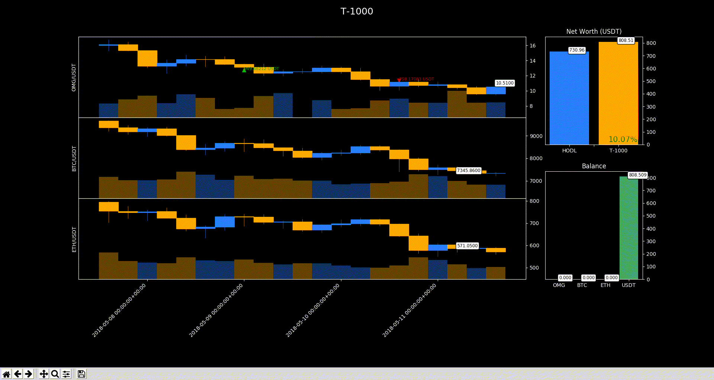
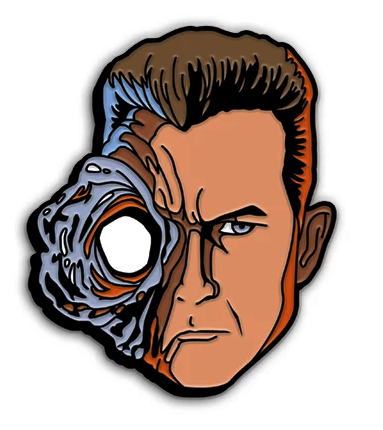

# T-1000 Advanced Prototype


[](https://app.codacy.com/app/Draichi/cryptocurrency_prediction?utm_source=github.com&utm_medium=referral&utm_content=Draichi/cryptocurrency_prediction&utm_campaign=Badge_Grade_Dashboard)



Deep reinforcement learning multi-agent algorithmic trading framework that learns to trade from experience and then evaluate with brand new data

* * *

## Prerequisites

-   [Miniconda](https://conda.io/docs/user-guide/install/index.html) or Anaconda

* * *

## Setup

### Ubuntu

```sh
# make sure you have these installed
sudo apt-get install gcc g++ build-essential python-dev python3-dev -y
# create env
conda env create -f t-1000.yml
# activate it
conda activate t-1000
```

* * *

## Usage

### On command line

```sh
# to see all arguments available
# $ python main.py --help

# to train
python main.py -a btc eth bnb -c usd

# to test
python main.py /
    -a btc eth bnb /
    -c usd /
    --checkpoint_path results/t-1000/model-hash/checkpoint_750/checkpoint-750
```

### On your own file

```py
# instatiate the environment
T_1000 = CreateEnv(assets=['OMG','BTC','ETH'],
                  currency='USDT',
                  granularity='day',
                  datapoints=600)

# define the hyperparams to train
T_1000.train(timesteps=5e4,
              checkpoint_freq=10,
              lr_schedule=[
                  [
                      [0, 7e-5],  # [timestep, lr]
                      [100, 7e-6],
                  ],
                  [
                      [0, 6e-5],
                      [100, 6e-6],
                  ]
              ],
              algo='PPO')

```

Once you have a sattisfatory reward_mean benchmark you can see how it performs with never seen data

```py
# same environment
T_1000 = CreateEnv(assets=['OMG','BTC','ETH'],
                  currency='USDT',
                  granularity='day',
                  datapoints=600)

# checkpoint are saved in /results
# it will automatically use a different time period from trainnig to backtest
T_1000.backtest(checkpoint_path='path/to/checkpoint_file/checkpoint-400')
```

* * *

## Features


-   state of the art [agents](https://ray.readthedocs.io/en/latest/rllib-algorithms.html)
-   hyperparam grid search
-   multi agent parallelization
-   learning rate schedule
-   result [analysis](https://ray.readthedocs.io/en/latest/tune-package-ref.html#ray.tune.Analysis)

> "It just needs to touch something to mimic it." - [Sarah Connor, about the T-1000](https://terminator.fandom.com/wiki/T-1000)

* * *

## Monitoring

Some nice tools to keep an eye while your agent train are (of course) `tensorboard`, `gpustat` and `htop`

```sh
# from the project home folder
$ tensorboard --logdir=results

# show how your gpu is going
$ gpustat -i

# show how your cpu and ram are going
$ htop
```
* * *

## Customizing

Edit the commision and initial balance values in `/variables.json`

* * *

## Credits

-   [Papers](https://github.com/Draichi/Portfolio-Management-list/blob/master/README.md)
-   [Analyzing cryptocurrency markets using python](https://blog.patricktriest.com/analyzing-cryptocurrencies-python/)
-   [Q-trader](https://github.com/edwardhdlu/q-trader)
-   [Trading-Gym](https://github.com/thedimlebowski/Trading-Gym)
-   [Tensor Trade](https://github.com/notadamking/tensortrade)

* * *

## To do

-   [ ] Bind the agent's output with an exchange place order API

<div style="text-align:center">
  
</div>
